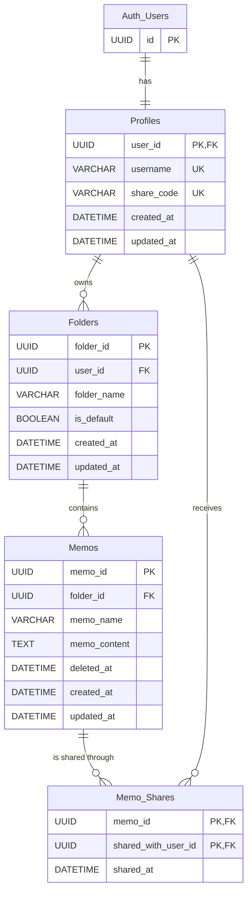

# DB設計

## 基本方針

- データベースにはPostgreSQLを使用する
- ORMとマイグレーション管理にはPrismaを使用する
- 認証にはSupabase Authを使用する
- 各テーブルのIDにはUUIDを使用する
- 認証情報はSupabaseの `auth.users` で管理する
- アプリで公開するユーザー情報は `public.profiles` で管理する
- メールアドレスと認証情報は他のユーザーに公開しない

## メモ共有

- メモの所有者は、`share_code` で指定したユーザーにメモを共有できる
- 1つのメモを複数のユーザーに共有できる
- 1回の共有操作で共有できるメモは1つだけとする
- 共有操作では対象の `memo_id` と共有先の `share_code` を受け取る
- 共有先の `user_id` はクライアントから受け取らず、バックエンドが `share_code` から取得する
- `user_id` はDB内部だけで使用し、他のユーザーには公開しない
- 共有されたユーザーには、メモの識別情報として `memo_id`、所有者の表示情報として `username` を公開する
- 共有されたユーザーには、閲覧対象となるメモの名前と内容を公開する
- 共有されたユーザーはメモを閲覧できる
- 共有されたユーザーはメモを編集・削除・再共有できない
- 共有時にメモのコピーは作成しない
- 所有者がメモを更新した場合、共有先にも更新後の内容を表示する
- 所有者は共有を解除できる
- 共有されたユーザーは、自分への共有を解除できる
- 同じメモを同じユーザーへ重複して共有できない

## 対象外

- 共有されたユーザーによる編集
- リアルタイム共同編集
- 編集履歴
- コメント
- 公開URLによる共有
- 共有の承認・拒否

## ER図

`Auth_Users` はSupabaseが管理する `auth.users` を表す。
それ以外のテーブルはアプリが `public` スキーマで管理する。

## テーブル定義

`NULL` を許可しないカラムは「必須」と表記する。

### auth.users

Supabase Authが管理する認証ユーザーテーブル。
アプリからテーブル構造を変更せず、主キーである `id` だけを外部キーの参照先として使用する。

| カラム | 用途 |
| --- | --- |
| `id` | Supabase Authが発行するユーザーのUUID |
| `email` | ログインとメール確認に使用する非公開情報 |
| 認証関連カラム | Supabase Authが管理するため、アプリでは直接操作しない |

### Profiles

アプリ内で利用・公開するユーザー情報を管理する。

| カラム | 制約 |
| --- | --- |
| `user_id` | PK、FK、必須、`auth.users.id` を参照 |
| `username` | 必須、一意、最大30文字 |
| `share_code` | 必須、一意、12文字、プロフィール作成時に自動生成 |
| `created_at` | 必須、作成時の日時を初期値とする |
| `updated_at` | 必須、作成時の日時を初期値とし、更新時に変更する |

#### usernameのルール

- 画面上のニックネームとして使用する
- 日本語を使用できる
- 前後の空白を除去して保存する
- 空文字、改行、タブなどの制御文字を禁止する
- 英字の大文字と小文字だけが異なる名前は同じ名前として扱う
- `admin`、`system`、`support` などの予約名を使用できない
- 後から変更できる

`username` は表示名として使用する。
初期実装では他のユーザーと同じ名前を使用できないように、一意制約を設定する。

#### share_codeのルール

- 共有相手を指定するための公開用IDとして使用する
- プロフィール作成時にランダムで自動生成する
- 12文字の英数字とする
- 英字は大文字へ統一して保存し、入力時は大文字と小文字を区別しない
- `0`、`O`、`1`、`I`、`L` などの判別しにくい文字を使用しない
- 全ユーザー間で一意とする
- 作成後は変更できない
- 生成した値が重複した場合は、新しい値を再生成する
- ユーザーは自分の `share_code` を確認・コピーできる

共有操作では `share_code` から対象ユーザーを検索するが、共有関係にはUUIDの `user_id` を保存する。
そのため、`username` を変更しても既存の共有関係には影響しない。
内部の `user_id` は、他のユーザー向けのレスポンスに含めない。
`share_code` は共有相手を指定する公開用IDとして、共有操作と所有者向けの共有先一覧で使用できる。

### Folders

| カラム | 制約 |
| --- | --- |
| `folder_id` | PK、必須、UUIDを自動生成 |
| `user_id` | FK、必須、`Profiles.user_id` を参照 |
| `folder_name` | 必須、最大100文字 |
| `is_default` | 必須、初期値は `false` |
| `created_at` | 必須、作成時の日時を初期値とする |
| `updated_at` | 必須、作成時の日時を初期値とし、更新時に変更する |

#### フォルダのルール

- ユーザー登録時にデフォルトフォルダを1つ作成する
- デフォルトフォルダは `is_default = true` とする
- 1人のユーザーが持てるデフォルトフォルダは1つだけとする
- デフォルトフォルダの存在は画面上でユーザーに意識させない
- フォルダ未指定で作成したメモはデフォルトフォルダへ保存する
- デフォルトフォルダは削除・名前変更できない
- 同じユーザーの中で同名フォルダを作成できない
- メモを別のフォルダへ移動できる
- 通常状態のメモが1件でも存在するフォルダは削除できない
- メモをゴミ箱へ移動すると、移動前のフォルダ情報を破棄し、所有者のデフォルトフォルダへ付け替える
- ゴミ箱内のメモは、移動前のフォルダの削除判定に含めない

同名フォルダは `(user_id, folder_name)` の一意制約で防止する。
デフォルトフォルダが複数作られることは、`is_default = true` の行をユーザーごとに1件へ制限する一意インデックスで防止する。

### Memos

| カラム | 制約 |
| --- | --- |
| `memo_id` | PK、必須、UUIDを自動生成 |
| `folder_id` | FK、必須、`Folders.folder_id` を参照 |
| `memo_name` | 必須、最大200文字 |
| `memo_content` | 必須、初期値は空文字 |
| `deleted_at` | NULL可、ゴミ箱へ移動した日時 |
| `created_at` | 必須、作成時の日時を初期値とする |
| `updated_at` | 必須、作成時の日時を初期値とし、更新時に変更する |

本文はユーザー入力としては任意とする。
DBでは `memo_content` を必須にし、本文がない場合は空文字を保存する。

#### ゴミ箱のルール

- 通常状態では `deleted_at = NULL` とする
- ゴミ箱へ移動するときは `deleted_at` に日時を保存する
- ゴミ箱へ移動するときは、`folder_id` を所有者のデフォルトフォルダのIDへ変更する
- 移動前の `folder_id` は別のカラムなどに保存せず、破棄する
- ゴミ箱へ移動するときは、対応する `Memo_Shares` をすべて削除して共有を解除する
- `deleted_at` の設定、デフォルトフォルダへの変更、共有解除は一連の処理として行う
- ゴミ箱から復元するときは `deleted_at` を `NULL` に戻し、デフォルトフォルダに配置する
- ゴミ箱へ移動する前のフォルダには復元しない
- ゴミ箱内のメモは通常のメモ一覧と共有先の一覧に表示しない
- ゴミ箱から復元しても、以前の共有状態は復元しない
- 復元後に共有する場合は、所有者が改めて共有操作を行う
- ゴミ箱から削除した場合は物理削除する
- 所有者は、自分のゴミ箱内にあるメモを一括で物理削除できる
- 一括削除の対象は、所有者本人のメモかつ `deleted_at IS NOT NULL` のメモだけとする
- 物理削除前に、元に戻せないことを伝える確認ウィンドウを表示する

### Memo_Shares

| カラム | 制約 |
| --- | --- |
| `memo_id` | 複合PK、FK、必須、`Memos.memo_id` を参照 |
| `shared_with_user_id` | 複合PK、FK、必須、`Profiles.user_id` を参照 |
| `shared_at` | 必須、共有時の日時を初期値とする |

主キーは `(memo_id, shared_with_user_id)` の組み合わせとする。
これにより、同じメモを同じユーザーへ重複して共有できないようにする。

## 日時情報

- すべての日時はUTCで保存する
- 画面表示時に利用者のタイムゾーンへ変換する
- `created_at` はレコード作成後に変更しない
- `updated_at` は対象レコードの内容が変わったときに更新する
- `shared_at` は共有を開始した日時を表す
- `deleted_at` はメモをゴミ箱へ移動した日時を表す

PostgreSQLではタイムゾーンを考慮できる日時型の使用を想定する。
具体的なPrismaの型とPostgreSQLの型は、Prisma Schema作成時に確定する。

## メモ共有の詳細

### 共有時

- 1回の共有操作では、1つの `memo_id` と1人分の `share_code` を受け取る
- 共有相手は `Profiles.share_code` で検索する
- 検索結果から取得した `Profiles.user_id` を `Memo_Shares.shared_with_user_id` に保存する
- クライアントから共有先の `user_id` は受け取らない
- 操作するユーザーがメモの所有者であることを確認する
- 共有先が所有者以外の登録済みユーザーであることを確認する
- メモの所有者は、そのメモが所属する `Folders.user_id` のユーザーとする

### 共有後

- 共有先は元のメモを閲覧するため、所有者による変更がそのまま反映される
- 共有先は閲覧だけできる
- 共有先のフォルダにはメモを保存しない
- 共有されたメモは専用の「共有されたメモ一覧」に表示する
- 所有者がメモをゴミ箱へ移動すると共有が解除され、共有先から閲覧できなくなる
- 所有者がメモを復元しても、以前の共有状態は復元しない
- 所有者は `Memo_Shares` を削除して共有を解除できる
- 共有されたユーザーも、自分に対応する `Memo_Shares` を削除できる
- 共有解除後、共有先ユーザーはメモを閲覧できない

## 認可ルール

認証はSupabase Authで行い、メモに対する認可はバックエンドで行う。

- メモの所有者だけがメモを編集できる
- メモの所有者だけがメモをゴミ箱へ移動・復元・物理削除できる
- メモの所有者だけがメモを共有できる
- 所有者または共有先本人だけが該当する共有を解除できる
- 所有者は `Memos → Folders → Profiles` の関係から判定する
- 共有先の閲覧権限は `Memo_Shares` から判定する
- `memo_id` が分かっていても、所有または共有されていないメモは取得できない
- 内部の `user_id` は他のユーザー向けのレスポンスに含めない
- Supabase Authのメールアドレスは他ユーザー向けのレスポンスに含めない

## 外部キー削除時の動作

| 関係 | 動作 | 理由 |
| --- | --- | --- |
| `auth.users → Profiles` | `ON DELETE CASCADE` | 認証ユーザーがなくなればプロフィールも不要になる |
| `Profiles → Folders` | `ON DELETE RESTRICT` | メモを含むユーザー削除を意図せず連鎖させない |
| `Folders → Memos` | `ON DELETE RESTRICT` | メモがあるフォルダを削除できないようにする |
| `Memos → Memo_Shares` | `ON DELETE CASCADE` | 元のメモが物理削除されたら共有情報も不要になる |
| `Profiles → Memo_Shares` | `ON DELETE CASCADE` | 共有先ユーザーが削除されたら共有情報も不要になる |

アカウント削除では、通常の外部キー削除とは別に、バックエンドのアカウント削除処理で関連する共有、メモ、フォルダ、プロフィール、Supabase Authユーザーを順番に削除する。

## インデックス

初期実装では次のインデックスを用意する。

| 対象 | 用途 |
| --- | --- |
| `Profiles.username` | 表示名の一意性の保証 |
| `Profiles.share_code` | 共有相手の検索、一意性の保証 |
| `Folders.user_id` | ユーザーのフォルダ一覧取得 |
| `(Folders.user_id, Folders.folder_name)` | ユーザー内の同名フォルダ防止 |
| `Memos.folder_id` | フォルダ内のメモ一覧取得 |
| `Memos.deleted_at` | 通常メモとゴミ箱の絞り込み |
| `Memo_Shares.shared_with_user_id` | 共有されたメモ一覧取得 |

## Prismaとマイグレーション

- Prisma Schemaを現在のDB構造を表す定義として管理する
- Prisma Migrateが生成する `migration.sql` をDB変更履歴として管理する
- `schema.prisma` と `prisma/migrations/` の両方をGitで管理する
- Prisma Schemaで表現しにくいPostgreSQL固有の制約は、生成された `migration.sql` に追加する
- デフォルトフォルダをユーザーごとに1件へ制限する一意インデックスなどは、必要に応じてカスタムSQLで定義する
