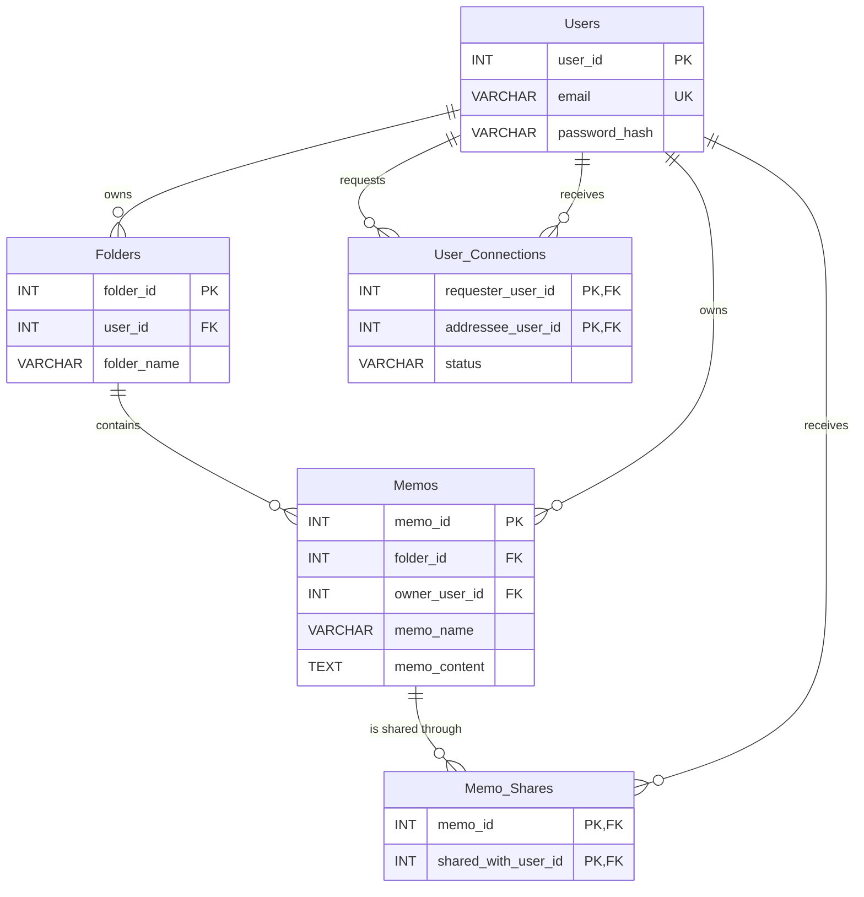

# DB設計

## メモ共有
- メモの所有者は、接続済みのユーザーにメモを共有できる
- 共有先は複数指定できる
- 共有されたユーザーはメモを閲覧できる
- 共有されたユーザーはメモを編集・削除できない
- メモの所有者は共有を解除できる
- 同一ユーザーへの重複共有はできない

## 対象外
- 共有されたユーザーによる編集
- リアルタイム共同編集
- 編集履歴
- コメント
- 公開URLによる共有

## ER図

