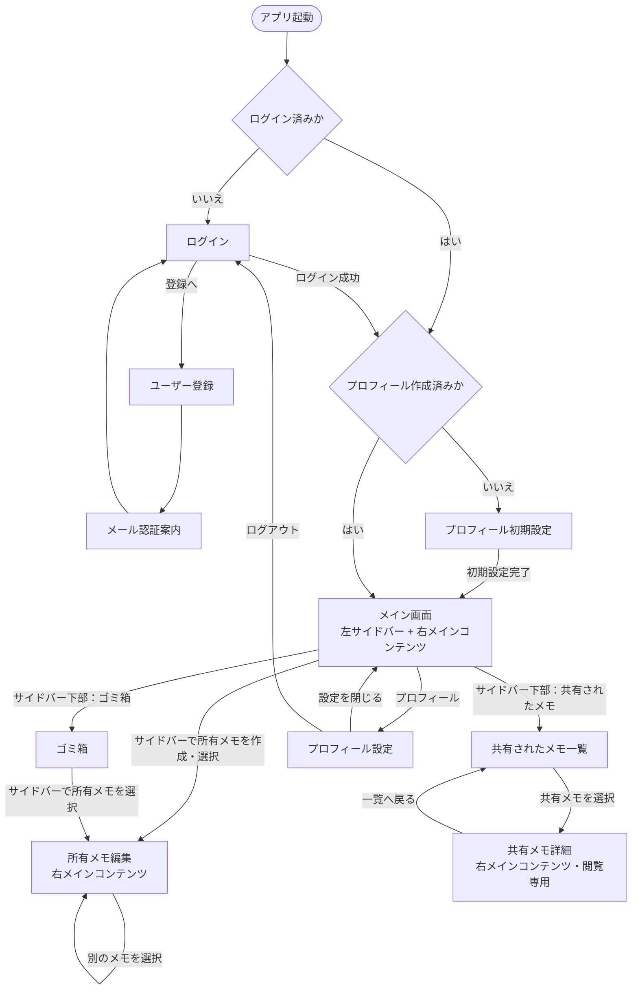

# 画面遷移

## 1. 概要

アプリに必要な画面、主な表示内容、操作による遷移を定義する。

## 2. 画面一覧

### 2.1 認証前

| 画面 | 目的 |
| --- | --- |
| ログイン | メールアドレスとパスワードでログインする |
| ユーザー登録 | メールアドレスとパスワードで登録する |
| メール認証案内 | Supabase Authによるメール認証を案内する |
| プロフィール初期設定 | 初回ログイン時にユーザー名を設定する |

### 2.2 認証後

| 画面 | 目的 |
| --- | --- |
| メイン画面 | VS Code風の共通レイアウトで、左サイドバーと右メインコンテンツを表示する |
| メモ一覧・編集 | 所有するフォルダと通常状態のメモを左サイドバーに表示し、選択したメモを右側で作成・閲覧・編集する |
| 共有されたメモ一覧 | 左サイドバー下部から、他のユーザーから共有されたメモの一覧を表示する |
| 共有メモ詳細 | 共有されたメモを閲覧専用で表示する |
| ゴミ箱 | 左サイドバー下部から、ゴミ箱内のメモを表示し、復元・完全削除を行う |
| プロフィール設定 | ユーザー名の変更、共有コードの確認、ログアウトを行う |

### 2.3 モーダル・確認ダイアログ

以下は独立した画面ではなく、操作元の画面上に表示することを想定する。

| UI | 目的 |
| --- | --- |
| フォルダ作成 | 新しいフォルダ名を入力する |
| フォルダ名変更 | 選択したフォルダの名前を変更する |
| フォルダ削除確認 | 空のフォルダを削除する |
| メモ共有 | 共有先の`share_code`を入力する |
| 共有先一覧 | メモの共有先を確認し、所有者が共有を解除する |
| メモ移動 | 所有者の別フォルダを移動先として選択する |
| ゴミ箱移動確認 | メモと共有状態への影響を確認する |
| 完全削除確認 | メモを復元できなくなることを確認する |
| ゴミ箱一括削除確認 | ゴミ箱内のすべてのメモを完全削除することを確認する |
| 共有解除確認 | 所有者または共有先ユーザーが共有を解除する |

## 3. 全体の画面遷移



## 4. 初回利用時の遷移

1. ユーザー登録画面で、メールアドレスとパスワードを入力する。
2. Supabase Authから送信されたメールを使用して認証する。
3. ログインする。
4. アプリプロフィールが未作成の場合、プロフィール初期設定画面へ移動する。
5. ユーザー名を設定する。
6. プロフィール、変更不可の`share_code`、デフォルトフォルダを作成する。
7. 左サイドバーと右メインコンテンツで構成されたメイン画面へ移動する。

## 5. 認証後の共通レイアウト

認証後は、VS Codeのように左側のサイドバーと右側のメインコンテンツで構成する。
画面を移動してもサイドバーは原則として表示したままとし、サイドバーで選択した項目に応じて右側の内容を切り替える。

```text
┌──────────────────────────┬──────────────────────────────────────────┐
│ 左サイドバー             │ 右メインコンテンツ                       │
│                          │                                          │
│ ▼ フォルダA              │ 選択内容に応じて切り替え                 │
│   ├ メモ1                │                                          │
│   └ メモ2                │ ・所有メモの編集                         │
│ ▶ フォルダB              │ ・共有されたメモ一覧／詳細               │
│   メモ3（フォルダ未指定）│ ・ゴミ箱                                 │
│                          │                                          │
│ ──────────────────────── │                                          │
│ 共有されたメモ           │                                          │
│ ゴミ箱                   │                                          │
│ プロフィール             │                                          │
└──────────────────────────┴──────────────────────────────────────────┘
```

### 5.1 左サイドバー

サイドバーは上部の所有メモ領域と、下部の共通ナビゲーション領域に分ける。

**上部：所有メモ**

- 自分が所有するフォルダをツリー形式で表示する。
- 各フォルダの配下に、そのフォルダにある通常状態のメモを表示する。
- デフォルトフォルダ自体は表示せず、その配下のメモをフォルダ未指定のメモとして表示する。
- フォルダを展開・折りたたみできる。
- フォルダまたはフォルダ未指定の位置からメモを作成できる。
- メモを選択すると、右メインコンテンツに編集画面を表示する。
- フォルダの作成、名前変更、削除、メモの移動を行える。

**下部：共通ナビゲーション**

- 「共有されたメモ」を表示する。
- 「ゴミ箱」を表示する。
- プロフィール設定への導線を表示する。
- 「共有されたメモ」または「ゴミ箱」を選択すると、右メインコンテンツの表示を切り替える。

### 5.2 右メインコンテンツ

- 所有メモを選択した場合は、メモ編集を表示する。
- 「共有されたメモ」を選択した場合は、共有されたメモ一覧を表示する。
- 共有メモを選択した場合は、共有メモ詳細を閲覧専用で表示する。
- 「ゴミ箱」を選択した場合は、ゴミ箱内のメモ一覧と操作を表示する。
- 何も選択されていない場合の表示内容は今後決定する。

## 6. 各画面のBaseline

### 6.1 ログイン

**表示・入力**

- メールアドレス
- パスワード
- ログインボタン
- ユーザー登録画面への導線

**遷移**

- ログイン成功かつプロフィール作成済み：メイン画面
- ログイン成功かつプロフィール未作成：プロフィール初期設定
- ユーザー登録を選択：ユーザー登録

### 6.2 ユーザー登録

**表示・入力**

- メールアドレス
- パスワード
- 登録ボタン
- ログイン画面への導線

**遷移**

- 登録受付後：メール認証案内
- ログインを選択：ログイン

### 6.3 メール認証案内

- 認証メールを確認するよう案内する。
- 認証完了後はログイン画面へ進む。
- 認証メール再送などの詳細は今後決定する。

### 6.4 プロフィール初期設定

**表示・入力**

- ユーザー名
- 初期設定完了ボタン

**処理結果**

- プロフィールを作成する。
- `share_code`を自動生成する。
- デフォルトフォルダを作成する。
- 完了後、メイン画面へ移動する。

### 6.5 メイン画面・メモ一覧

**表示**

- 左サイドバーに、所有するフォルダと通常状態のメモをツリー形式で表示する。
- フォルダ未指定として扱うメモを表示する。
- 左サイドバー下部に、共有されたメモ一覧、ゴミ箱、プロフィール設定への導線を表示する。
- 右メインコンテンツに、選択中の項目に対応する内容を表示する。

**操作**

- フォルダの展開・折りたたみ・作成・名前変更・削除
- メモの作成・選択
- メモの別フォルダへの移動
- サイドバー下部から、共有されたメモ一覧またはゴミ箱へ表示を切り替える。

**ルール**

- デフォルトフォルダ自体は画面に表示しない。
- デフォルトフォルダ内のメモは、フォルダ未指定のメモとして表示する。
- 通常状態のメモが入ったフォルダは削除できない。
- 認証後の操作中は、左サイドバーを原則として常に表示する。

### 6.6 メモ編集

**表示・入力**

- 左サイドバー
- メモ名
- メモ内容
- 所属フォルダ
- 共有操作
- 共有先一覧
- ゴミ箱へ移動する操作

**操作**

- 新しいメモを保存する。
- メモ名・内容を変更する。
- 所有する別のフォルダへ移動する。
- `share_code`を指定して、1回につき1件のメモを1人へ共有する。
- 共有先を確認・解除する。
- メモをゴミ箱へ移動する。

**ゴミ箱へ移動した場合**

- 移動前のフォルダ情報を破棄する。
- すべての共有を解除する。
- 処理後は右メインコンテンツから対象メモを閉じ、左サイドバーの所有メモ表示へ戻る。

### 6.7 共有されたメモ一覧

**表示**

- 左サイドバー
- 自分に共有されているメモ
- メモ名
- 所有者のユーザー名

**操作**

- メモを選択して共有メモ詳細へ移動する。
- 自分に対する共有を解除する。

**ルール**

- 所有メモとは別の一覧として、右メインコンテンツに表示する。
- 共有されたメモを自分のフォルダには追加しない。

### 6.8 共有メモ詳細

**表示**

- 左サイドバー
- メモ名
- メモ内容
- 所有者のユーザー名

**操作**

- 共有されたメモ一覧へ戻る。
- 自分に対する共有を解除する。

**ルール**

- 閲覧専用とする。
- 編集、削除、移動、再共有はできない。
- 所有者が更新した場合は、更新後の内容を表示する。

### 6.9 ゴミ箱

**表示**

- 左サイドバー
- ゴミ箱に入っている自分のメモ
- 復元操作
- 1件の完全削除操作
- 一括完全削除操作

**復元**

- 復元したメモはデフォルトフォルダへ配置する。
- 移動前のフォルダと共有状態は復元しない。

**完全削除**

- 実行前に、復元できないことを確認する。
- 1件削除と一括削除の両方を用意する。

### 6.10 プロフィール設定

**表示・入力**

- ユーザー名
- 変更不可の`share_code`
- `share_code`のコピーボタン
- ログアウト操作

**操作**

- ユーザー名を変更する。
- `share_code`をコピーする。
- ログアウトする。

**ルール**

- `share_code`は編集できない。
- 他のユーザーの`user_id`、メールアドレス、認証情報は表示しない。

## 7. 確認が必要な操作

次の操作では、実行結果や取り消し可否をユーザーへ明示する。

| 操作 | 確認内容 |
| --- | --- |
| メモをゴミ箱へ移動 | 移動前のフォルダ情報とすべての共有が失われる |
| メモを完全削除 | 削除後は復元できない |
| ゴミ箱を一括削除 | ゴミ箱内のすべてのメモが復元できなくなる |
| 共有を解除 | 対象ユーザーがメモを閲覧できなくなる |
| 共有先本人が解除 | 自分の共有メモ一覧から対象メモが消える |
| フォルダを削除 | 対象フォルダが削除される |

## 8. 未確定事項

- React Routerで使用する具体的なURL
- スマートフォン表示時にサイドバーを常設するか、開閉式にするか
- 左サイドバーの幅、折りたたみ、リサイズ操作
- メモの保存を明示的な保存ボタンにするか、自動保存にするか
- メモ移動を選択操作とドラッグ操作のどちらにするか
- フォルダ・メモの検索、並び順、ページネーション
- 認証メール再送とパスワード再設定の画面
- エラー、読み込み中、データがない場合の表示
